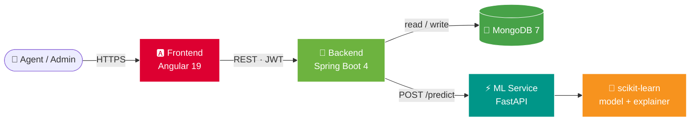
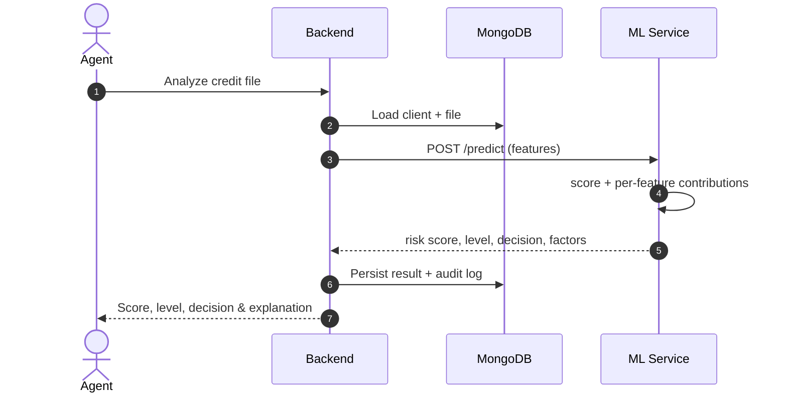

<div align="center">


_Internship project — Arab Tunisian Bank × ESPRIT_

[](../../actions/workflows/ci.yml)
[](../../actions/workflows/security.yml)
[](https://sonarcloud.io/summary/new_code?id=Azer-khadhraoui_ATB-Credit-Platform)
[](../../releases)

[](frontend)
[](backend)
[](ml-service)
[](#)
[](docker-compose.yml)
[](k8s)
[](.github/workflows/security.yml)

</div>

---

## Overview

An internal platform for bank agents and administrators to manage clients and credit files, with an ML model that scores each application's risk — and **explains what drove the score**.

The model assists the decision; it never replaces it. Every prediction is broken down per feature so an agent can defend the outcome to a client.

## Demo

https://github.com/user-attachments/assets/21e715c9-96fd-40f8-806f-8bbb971c5fb7

Creating a client, opening a credit file, running the AI analysis, and reading the per-feature explanation.

## Architecture



The ML service knows nothing about MongoDB or authentication — it exposes a scoring model and nothing else. The frontend holds no business logic.

## Explainable scoring

The model returns each feature's contribution to the decision, computed as `coefficient × (value − training mean)` in log-odds. Weighting by the distance from an average applicant is what makes the explanation specific to that file rather than a general statement about the model.

The six strongest factors are persisted and rendered as ranked bars — green lowers risk, red raises it:

| Feature | Impact | Direction |
|---|---:|---|
| Credit history | −2.40 | ▲ raises risk |
| Loan term | +0.77 | ▼ lowers risk |
| Education | −0.35 | ▲ raises risk |

<details>
<summary><b>How an analysis flows through the system</b></summary>



</details>

## Stack

| Layer | Technology |
|---|---|
| Frontend | Angular 19 (standalone components, signals), TypeScript, SCSS |
| Backend | Spring Boot 4.1, Java 21, Spring Security, JWT + BCrypt |
| Database | MongoDB 7 |
| ML service | Python 3.11, FastAPI, scikit-learn, pandas |
| Packaging | Docker (multi-stage, non-root), Nginx |
| Orchestration | Docker Compose, Kubernetes |
| Infrastructure as Code | Terraform (Kubernetes provider) |
| Observability | Prometheus, Grafana, Spring Boot Actuator + Micrometer |
| CI/CD | GitHub Actions, SonarCloud, Trivy, CodeQL, Gitleaks, OWASP ZAP |

## Features

| Module | Capability |
|---|---|
| **Auth** | JWT (stateless), BCrypt, roles `ADMIN` / `AGENT_CREDIT`, role checks enforced server-side |
| **Users** | CRUD, profile photo, password change, self-service profile page |
| **Clients** | CRUD, personal / contact / employment data |
| **Credit files** | CRUD, status workflow, search |
| **AI analysis** | Risk score, level (`LOW`/`MEDIUM`/`HIGH`), decision (`ACCEPTABLE`/`RISKY`/`REJECTED`) + per-feature explanation |
| **Audit log** | Every sensitive action traced with its author — admin-only access |
| **Dashboard** | Volumes, status and risk distribution, recent activity |
| **Monitoring** | Backend metrics scraped every 15s; Grafana panels for traffic, latency, JVM memory, CPU and threads |

## Quick start

### Docker Compose

```bash
cp .env.example .env      # set JWT_SECRET
docker compose up --build -d
```

| Service | URL |
|---|---|
| Web app | http://localhost:4200 |
| API | http://localhost:8081 |
| ML service | http://localhost:8000/docs |

Startup is ordered by healthchecks — the backend waits until MongoDB and the ML service actually respond, not merely until they start.

### Kubernetes

```bash
kubectl apply -f k8s/00-namespace.yaml -f k8s/01-config.yaml

kubectl create secret generic atb-jwt -n atb \
  --from-literal=JWT_SECRET="$(openssl rand -base64 48)"

kubectl apply -f k8s/
```

MongoDB runs as a StatefulSet with its own PVC; the ML service stays internal (ClusterIP); backend and frontend are exposed via LoadBalancer. See [`k8s/README.md`](k8s/README.md).

### Monitoring

Prometheus and Grafana ship with the manifests above:

```bash
kubectl create secret generic grafana-admin -n atb \
  --from-literal=password="$(openssl rand -base64 18)"
```

Grafana then answers on http://localhost:3000 with the Prometheus datasource and the backend dashboard already registered — both are provisioned from ConfigMaps, so a setting is never lost to a pod restart the way a UI change would be.

### Terraform

An alternative to applying the manifests by hand, in its own namespace so the two never collide:

```bash
cd terraform
terraform init
terraform plan     # shows the exact diff before anything changes
terraform apply
```

`terraform plan` is the reason to reach for it: `kubectl apply` reports what it did, Terraform reports what it *will* do (`~ replicas = "1" -> "2"`). It tracks what it created in a state file, which is why it manages `atb-tf` rather than the namespace kubectl already owns.

### Container images

```bash
docker pull ghcr.io/azer-khadhraoui/atb-backend:v1.0.0
```

Published to GHCR on every `v*` tag.

## Testing

| Suite | Tests | Tooling |
|---|---:|---|
| Backend | 36 | JUnit 5, Mockito, JaCoCo |
| Frontend | 49 | Jasmine, Karma, lcov |
| ML service | 7 | pytest, pytest-cov |

Coverage from all three feeds the SonarCloud quality gate, which blocks on coverage and duplication of new code.

Backend tests pin the domain-to-model feature mapping — including the TND → thousands loan-amount scale that once skewed every prediction — so the contract with the model cannot drift silently.

## Security & DevSecOps

Security is not a release-time audit here: it runs on the same trigger as the tests, on every push and pull request. That is what makes the pipeline **DevSecOps** rather than CI with a security review bolted on afterwards.

### Application hardening

- Passwords hashed with **BCrypt**; JWT signing key supplied at runtime via `JWT_SECRET` and **never committed** — the app refuses to start if it is missing or under 32 characters.
- Authorization enforced **server-side**: `/api/audit-logs` returns `403` for non-admins regardless of what the UI shows.
- Containers run as **non-root** from minimal base images, built in multi-stage builds so compilers never ship to production.

### Automated analysis

| Tool | Type | Scope |
|---|---|---|
| Gitleaks | Secrets | Full git history |
| CodeQL | SAST | Java, TypeScript, Python |
| Trivy | SCA | Project dependencies |
| Trivy | Image | The three Docker images |
| OWASP ZAP | DAST | The **running** application |
| SonarCloud | Quality | Coverage, duplication, maintainability |

SAST inspects code, SCA inspects dependencies, DAST attacks the live app — none of the three covers the other two. Results land in the repository's *Security* tab as SARIF, with a weekly re-scan since new CVEs get published against unchanged code.

Scans **report without blocking**: a transitive CVE with no available fix should not stop a release. Dependabot keeps Maven, npm, pip, base images and the Actions themselves current, grouped per ecosystem.

## Repository layout

```
├── frontend/            Angular app + Dockerfile + Nginx config
├── backend/             Spring Boot API + Dockerfile
├── ml-service/          FastAPI service + Dockerfile
│   ├── app/               Endpoints, model loading, explanation
│   ├── models/            Trained model and artifacts (.pkl)
│   └── notebooks/         Data preparation and training
├── k8s/                 Kubernetes manifests, incl. Prometheus and Grafana
├── terraform/           Same workload as HCL, in its own namespace
├── .github/workflows/    CI and DevSecOps pipelines
├── docker-compose.yml
└── .env.example         Configuration template (secrets stay out of git)
```

## Roadmap

- [x] JWT authentication & role management
- [x] Users, clients and credit-file management
- [x] ML risk scoring
- [x] Per-decision explainability
- [x] Audit log & dashboard
- [x] Docker packaging & Compose orchestration
- [x] CI/CD pipeline (GitHub Actions)
- [x] DevSecOps — SAST, SCA, DAST, secret scanning, quality gate
- [x] Test suites across all three services
- [x] Kubernetes deployment
- [x] Observability — Prometheus metrics, provisioned Grafana dashboard
- [x] Infrastructure as Code — Terraform (Kubernetes provider)

<div align="center">


<sub>Arab Tunisian Bank — ESPRIT, Cloud Computing &amp; Cybersecurity</sub>


</div>
